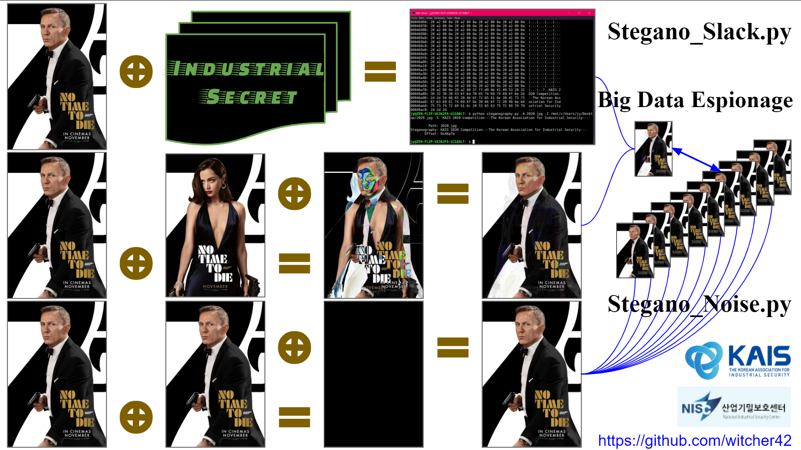

> **`사이버전은 일거에 국가시스템을 마비시킬 수 있는 ‘제5세대 전쟁’ 또는 ‘블랙 스완(Black Swan)’으로 불리는 새로운 형태의 전쟁`**
>> *김일기 국가안보전략연구소 선임연구원* 
## National Industries Cyber Infiltration Scenario and Full Spectrum Industrial Counter-Espionage  
This paper mainly talks about ‘China Communist Party Infiltration on Korean Telecommunication Industry’, which is reassembled by the frauds story in the 4.15 Parliamentary Election. And then we will introduce the Sabotage Technics and Cyber Counter-Intelligence.  
  
youtube🎬🎥 https://youtu.be/KppZpz0vWCM  
## 국가기간산업 사이버 침투 시나리오 및 전방향 산업 방첩
**[2020 KAIS 산업보안논문 경진대회] 특별공모 신안보위협과 산업보안의 역할변화**  
  
4.15 총선 부정선거 의혹을 통해 제기된 정보로 재구성한 ‘정보통신산업에 침투한 중국 공산당의 사이버 공작 시나리오’를 살펴본다. 이후 산업스파이의 인적·물리적 공작 기술들과 실제 사례들을 하나씩 소개한다. 후반부에는 방첩 기술이 소개되어있다.
  
  
   
Stegano_Slack.py:  
`python Stegano_Slack.py -K CipyherKey -A OutputImage.jfif -I InputImage.jfif -S Industrial Secret`  
Stegano_Noise.py:  
`python Stegano_Noise.py -N 007.jpg -I 700.jpg -S XORImage.jpg -C OutputImage.jpg`  
Torpedo_Decoy.py:   
`sudo python Torpedo_Decoy.py 502`   
`nc [ip] 502`  
GAN:  
-----  
System #1: (Server)WSL Kali  
System #2: (Client)Windows 10  
System #3: (Client)WSL Ubuntu  
